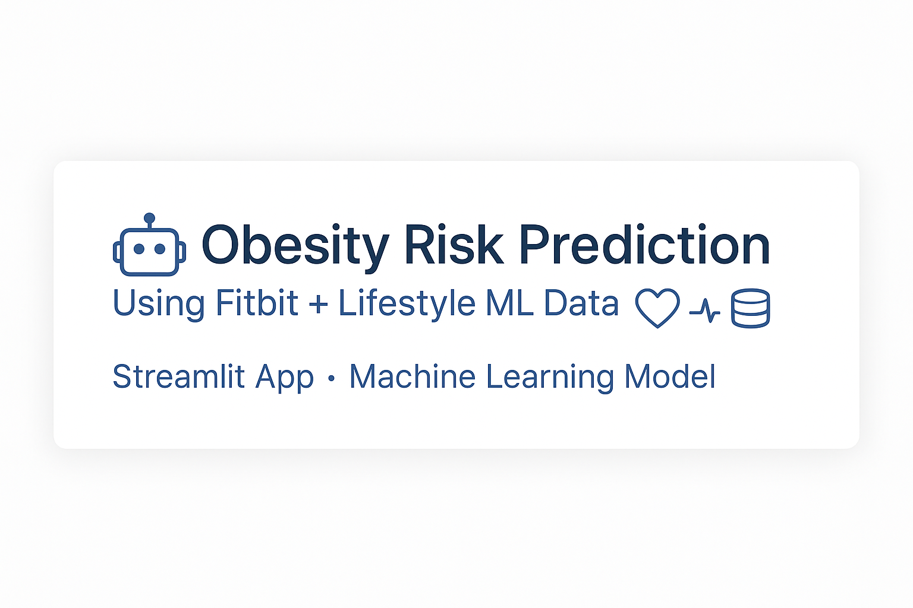
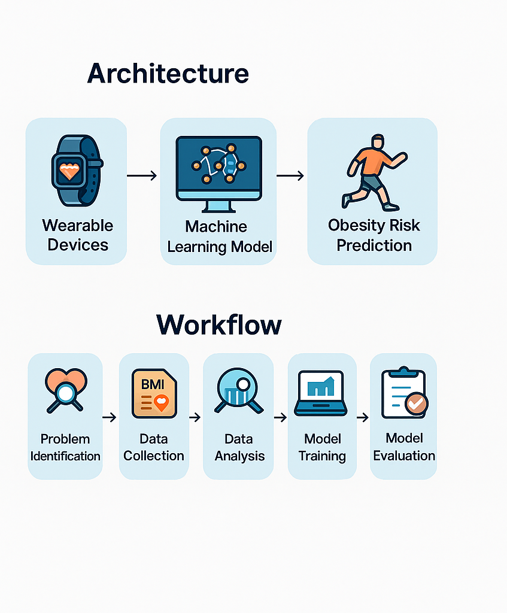
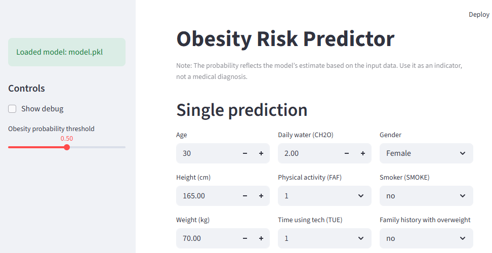
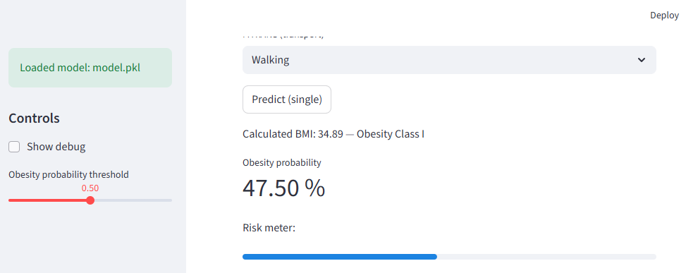
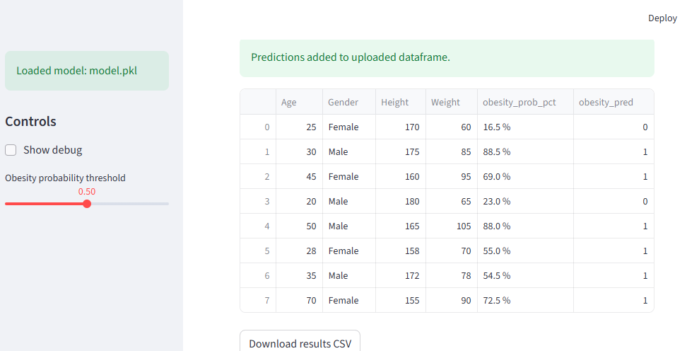

# 🌟 Obesity Risk Prediction Using Lifestyle & Fitbit-Derived Data



---

## 📌 Project Overview

This project develops a **hybrid machine learning model** that predicts **obesity risk** using:

- Lifestyle & demographic data from an **Obesity Dataset**
- Population-level health metrics derived from **Fitbit daily activity and sleep data**

The model is deployed using **Streamlit**, allowing users to enter their lifestyle information and receive an estimated **obesity risk percentage**.

---

## 🧠 System Architecture



---

## 📊 Datasets Used

### **1. Obesity Dataset**
Contains:
- Age, gender  
- Height, weight  
- Diet habits  
- Physical activity  
- Lifestyle behaviors  
- Obesity Level (target)

### **2. Fitbit Aggregated Dataset**
Contains **population-level averages** for:
- Steps  
- Sleep quality  
- Stress score  
- RMSSD (HRV metric)

These are appended to the obesity dataset for hybrid modeling.

---

## 🛠️ Project Structure

```
digital-health-obesity-prediction/
│
├── app/
│   ├── app.py                         ← Streamlit application
│   ├── model.pkl                      ← Hybrid machine learning model (Obesity + Fitbit)
│   └── __pycache__/                   ← Auto-generated; ignored by GitHub
│
├── data/
│   ├── raw/
│   │   ├── ObesityDataSet_raw_and_data_sinthetic.csv
│   │   └── daily_fitbit_sema_df_unprocessed.csv
│   │
│   ├── processed/
│   │   ├── per_user_fitbit_aggregates.csv
│   │   ├── obesity_fitbit_augmented.csv
│   │   └── fitbit_obesity_files.zip        ← Ready-to-download bundle
│   │
│   └── data_documentation.md               ← Combined Fitbit + Obesity data documentation
│
├── notebooks/
│   ├── eda.ipynb                            ← Exploratory analysis (Obesity + Fitbit)
│   └── model_training.ipynb                 ← Optional: model training visualization
│
├── src/
│   ├── train_hybrid_model.py                ← New hybrid training script (Fitbit + Obesity)
│   └── make_fitbit_aggregates_and_augment.py← Fitbit preprocessing + augmentation
│
├── docs/
│   ├── project_plan.md                  ← project summary and timeline
│
├── images/
│   ├── banner.png                           ←  banner used in README
│   ├── obesity_prediction_diagram.png
│
├── README.md                                ← Main project documentation 
├── requirements.txt                          ← Dependencies for Streamlit Cloud deployment
├── .gitignore                                ← Ignored files/folders


```

---

## 🧬 Hybrid Model Description

The model uses:
- **StandardScaler** for numeric features  
- **OneHotEncoder** for categorical features  
- **RandomForest** or **Logistic Regression** as the predictor  

The output includes:
- **Obesity probability (%)**
- **Obesity class prediction**
- **Risk meter visualization**

---

## 🖥️ Screenshots

### Streamlit App — Home


### Single Prediction Output Example 


### CSV file Prediction Output Example 


---

## 🚀 How to Run Locally

```bash
pip install -r requirements.txt
streamlit run app/app.py
```

---

## 🧾 License
This project is developed for the **MIT Emerging Talent Program-Experiential Learning Opportunitiy** and is intended for educational and research purposes.

---

## ✨ Author
**Heba Abudahrouj**  
MIT Emerging Talent | Computer & Data Science 
